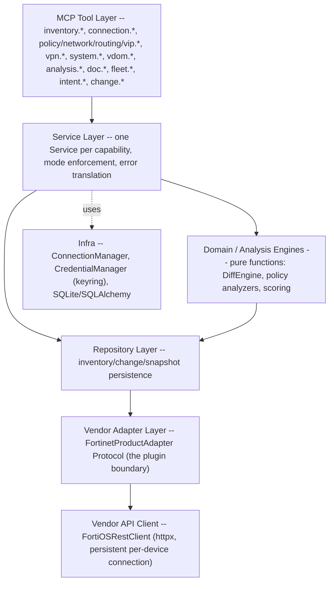

<p align="center">
  
</p>

<h1 align="center">FortiGate MCP Server</h1>

<p align="center">
  <strong>Take a FortiGate from out-of-the-box to fully configured through Claude (or any MCP client) --
  safely, with every change previewed before it's applied.</strong>
</p>

<p align="center">
  
  
  
  
  
</p>

<p align="center">
  <a href="#overview">Overview</a> &bull;
  <a href="#features">Features</a> &bull;
  <a href="docs/INSTALLATION.md">Installation</a> &bull;
  <a href="docs/USAGE.md">Usage</a> &bull;
  <a href="docs/TOOLS.md">Tool Reference</a> &bull;
  <a href="#architecture">Architecture</a> &bull;
  <a href="#security-model">Security</a> &bull;
  <a href="#known-limitations">Limitations</a>
</p>

---

## Overview

This is an MCP (Model Context Protocol) server that lets an AI assistant manage FortiGate firewalls -- from a single lab device to a multi-tenant estate of dozens of customers, sites, and clusters.

It's built around three ideas that most FortiGate automation tooling doesn't have all three of at once:

1. **Nothing mutates without a preview.** Every create/update/delete call returns a diff and a `change_id` instead of executing immediately. A separate `change_apply` call is what actually runs it, and it re-checks the live state for drift before doing so. There is no single-shot "just do it" mode, even for trusted automation.
2. **Claude never sees a real credential.** Device passwords/API tokens are provisioned through a local, non-MCP CLI (`fortinet-mcp-cred`) straight into your OS credential store (Windows Credential Manager / macOS Keychain / Linux Secret Service). The MCP tool surface only ever handles an opaque `credential_id`.
3. **It covers the whole lifecycle, not just policy CRUD.** Device bootstrap (DNS/NTP/syslog/SNMP/admin/HA), VDOM multi-tenancy, interfaces/zones/DHCP, routing, firewall policy, VPN (IPsec + SSL), security/compliance analysis, and documentation generation are all first-class tool namespaces -- see the full [Tool Reference](docs/TOOLS.md) (115 tools).

## Features

| Domain | What you get |
|---|---|
| **Inventory & multi-tenancy** | Customer -> Site -> Device -> VDOM hierarchy in a local SQLite store. Resolve a device by name, site, customer, or IP -- never by typing an IP into a prompt. |
| **Device bootstrap** | DNS, NTP, syslog, SNMP (sysinfo + v1/v2c communities), global settings (hostname/timezone/admin ports), local admin accounts, HA -- everything needed to take a device from factory defaults to production-ready. |
| **VDOM lifecycle** | Create/delete VDOMs, create/delete inter-VDOM links. |
| **Network topology** | Interfaces (VLAN sub-interfaces, loopbacks, vdom-link members), zones, DHCP servers, static routes. |
| **Firewall & NAT** | Policies, address/service objects, virtual IPs -- full CRUD. |
| **VPN** | IPsec site-to-site tunnels (phase1/phase2) with live status; SSL VPN visibility. |
| **Change safety** | READ_ONLY / SAFE / FULL operating modes, preview -> apply -> rollback for every mutation, drift detection at apply time. |
| **Analysis & compliance** | Duplicate/shadowed/any-any policy detection, unused object detection, subnet overlap, best-practice checks (policy *and* system config), a heuristic 0-100 security score, a combined compliance report. |
| **Documentation generation** | Topology diagrams (Mermaid/drawio/PlantUML), policy/routing/VPN/system-config Markdown docs, a combined export. |
| **Fleet operations** | Compare devices, search for an object across the whole estate, sync objects, replicate config, fleet-wide reports. |
| **Natural-language intents** | Composite tools (`intent_create_policy`, `intent_explain_policy_failure`, ...) that resolve fuzzy names and compose the primitives above. |

See [`docs/TOOLS.md`](docs/TOOLS.md) for the complete, generated list of all 115 tools.

## Quick Start

```bash
git clone https://github.com/Serrinho02/fortigate-mcp-server.git
cd fortigate-mcp-server
uv sync
```

Create a minimal `config/config.json` (the legacy single-file device list is optional once you're using the inventory system below -- see [Installation](docs/INSTALLATION.md)):

```json
{ "fortigate": { "devices": {} } }
```

Point your MCP client (e.g. Claude Desktop) at the server:

```json
{
  "mcpServers": {
    "fortigate": {
      "command": "/absolute/path/to/fortigate-mcp-server/.venv/bin/python",
      "args": ["-m", "src.fortigate_mcp.server"],
      "env": {
        "FORTIGATE_MCP_CONFIG": "/absolute/path/to/fortigate-mcp-server/config/config.json",
        "FORTINET_MCP_MODE": "full"
      }
    }
  }
}
```

Then, from Claude: register a device (`inventory_register_device_pending`), provision its credential locally with `fortinet-mcp-cred set <credential_id>`, and call `get_device_status`. Full walkthrough, Windows paths, and Docker instructions: **[docs/INSTALLATION.md](docs/INSTALLATION.md)**. Concept guide and worked examples: **[docs/USAGE.md](docs/USAGE.md)**.

## Architecture

Seven layers, dependency flows one direction only:



`FortinetProductAdapter` is the only extensibility boundary: today `FortiOSAdapter` is the sole implementation, but adding another Fortinet product means writing one new adapter against the same Protocol -- nothing above that layer changes.

## Operating Modes

Set via `FORTINET_MCP_MODE` (default `full`):

| Mode | Behavior |
|---|---|
| `read_only` | No mutation may even be previewed. |
| `safe` | Delete operations are rejected; create/update still require preview -> apply. |
| `full` | Every operation is allowed, but **still** requires preview -> apply -- there is no single-shot fast path in any mode. |

## Security Model

- Device credentials are never a tool argument and never appear in a conversation. `inventory_register_device_pending` only collects metadata (host, name, customer, site) and mints an opaque `credential_id`; the actual secret is entered once, locally, via `fortinet-mcp-cred set <credential_id>`, straight into the OS credential store.
- `connection_connect` / any tool needing a live session will fail with a clear "credential not provisioned" error until that CLI step is done -- there's no fallback path that lets a secret flow through MCP.
- Two documented exceptions, both flagged directly in their tool descriptions: an IPsec tunnel's PSK (`vpn_create_ipsec_tunnel`) and a local admin account's password (`system_create_admin`) *are* normal tool arguments, because FortiOS itself never returns them on GET -- there is no way to preview/diff them without the value passing through the call once.

## Known Limitations

- **No declarative "apply this desired state" tool.** By design -- Claude composes the granular tools itself (see `intent.*` for the pattern), rather than this server owning a Terraform/Ansible-style apply engine.
- **Docker + headless Linux:** the credential manager wraps the OS `keyring` library. On a container/headless Linux host with no Secret Service daemon, you need the `keyrings.cryptfile` fallback (not wired up by default) -- see [docs/INSTALLATION.md](docs/INSTALLATION.md#docker). Native install on Windows/macOS/desktop Linux works out of the box.
- **SNMP:** only v1/v2c communities are supported; no SNMPv3 users yet.
- **No FortiManager/FortiWeb/other Fortinet product adapters yet** -- the adapter Protocol supports it, nothing is implemented beyond FortiOS.
- Verified end-to-end with real HTTP traffic captured against a mocked FortiOS REST API; if you hit a real-device quirk, please open an issue with the FortiOS version and endpoint.

## Testing

```bash
uv run pytest
```

548 tests, no external dependencies required (device interaction is mocked at the HTTP transport layer for the full suite).

## Contributing

Issues and PRs welcome. If you're adding a new resource type, look at how the VPN or system-configuration domains were added (`services/vpn_service.py`, `services/system_service.py`, `services/change_dispatch.py`) -- every new mutating resource follows the same adapter -> change_dispatch -> service -> MCP tool pattern.

## Author

Built and maintained by **Nicola Serra**.

## License

MIT -- see [LICENSE](LICENSE).
